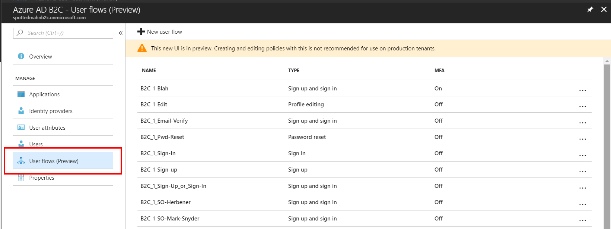
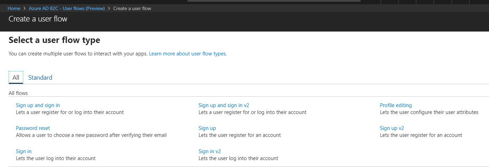

# Review of the B2C Azure Portal Updates

Reference: [Blog post announcement](https://blogs.msdn.microsoft.com/azureadb2c/2018/05/07/ui-updates-for-creatingediting-policies-application-access-management-for-minors/)

### The policies sub-section has been replaced with "User Flows"

---

### New UI for creating User Flows (aka policies)

---

### Create User Flow Details

---

### New UI for Editing User Flows

I really like this change 🤩.  The previous UI created a bunch of blades that kept going to the right.  The new UI is much easier to navigate IMO.

